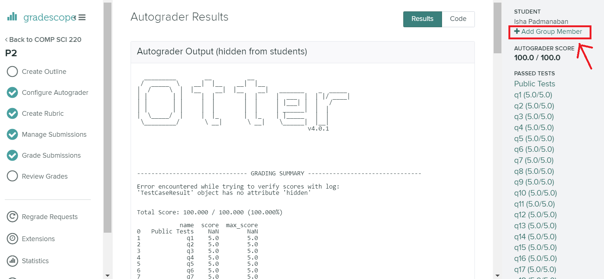

# Project 13 (P13): World University Rankings

## Corrections and clarifications:

* **4/27/2023 - 12:00 PM**: For both Question 17 and Question 18, the testing script is faulty. You will need to swap the `x` and `y` arguments to pass the autograder. This does not cause any logical errors, and you can proceed to plot the graphs with the correct `x` and `y` axes as mentioned in the question.

**Find any issues?** Report to us:

- Iffat Nafisa <nafisa@wisc.edu>
- Jodi Lawson <jlawson6@wisc.edu>

## Instructions:

This project will focus on **SQL**, and **Plotting**. To start, download [`p13.ipynb`](https://git.doit.wisc.edu/cdis/cs/courses/cs220/cs220-s23-projects/-/tree/main/p13/p13.ipynb), [`p13_test.py`](https://git.doit.wisc.edu/cdis/cs/courses/cs220/cs220-s23-projects/-/tree/main/p13/p13_test.py), and [`p13_expected.html`](https://git.doit.wisc.edu/cdis/cs/courses/cs220/cs220-s23-projects/-/tree/main/p13/p13_expected.html).

**Important Warning:** You must **not** manually download any of the other files. In particular, you are **not** allowed to manually download the file `QSranking.json`. You **must** download this files using Python in your `p13.ipynb` notebook as a part of the project. Otherwise, your code may pass on **your computer**, but **fail** on the testing computer.

You will work on `p13.ipynb` and hand it in. You should follow the provided directions for each question. Questions have **specific** directions on what **to do** and what **not to do**.

------------------------------

## IMPORTANT Submission instructions:
- Review the [Grading Rubric](https://git.doit.wisc.edu/cdis/cs/courses/cs220/cs220-s23-projects/-/tree/main/p13/rubric.md), to ensure that you don't lose points during code review.
- You must **save your notebook file** before you run the cell containing **export**.
- Login to [Gradescope](https://www.gradescope.com/) and upload the zip file into the P13 assignment.
- If you completed the project with a **partner**, make sure to **add their name** by clicking "Add Group Member"
in Gradescope when uploading the P13 zip file.

   

   **Warning:** You will have to add your partner on Gradescope even if you have filled out this information in your `p13.ipynb` notebook.

- It is **your responsibility** to make sure that your project clears auto-grader tests on the Gradescope test system. Otter test results should be available in a few minutes after your submission. You should be able to see both PASS / FAIL results for the 20 test cases and your total score, which is accessible via Gradescope Dashboard (as in the image below):

    
- **Important:** After you submit, you **need to verify** that your code is visible on Gradescope. If you displayed the output of a large variable anywhere in your notebook, **we will not be able to view your submission**. Make sure you don't have any large outputs in any of your cells, and verify after submission that your code can be viewed.
- If you feel you have been incorrectly graded on a particular question by the Gradescope autograder, please make a regrade request.
